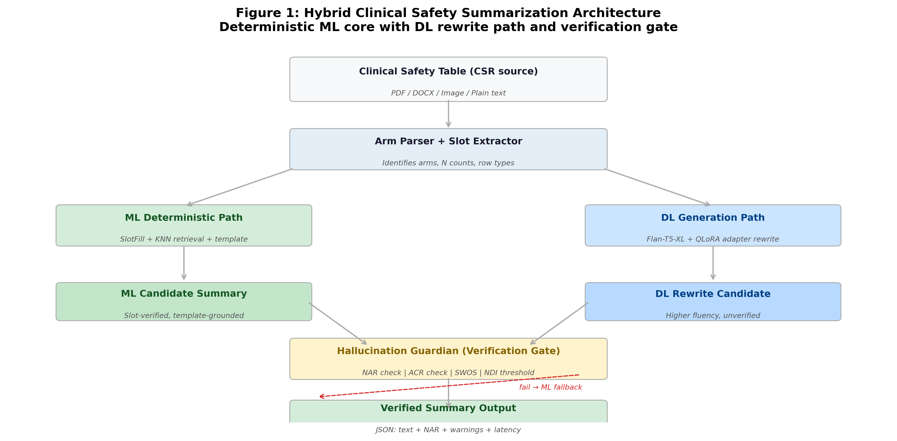
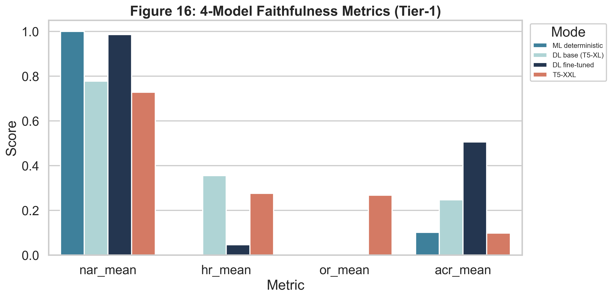
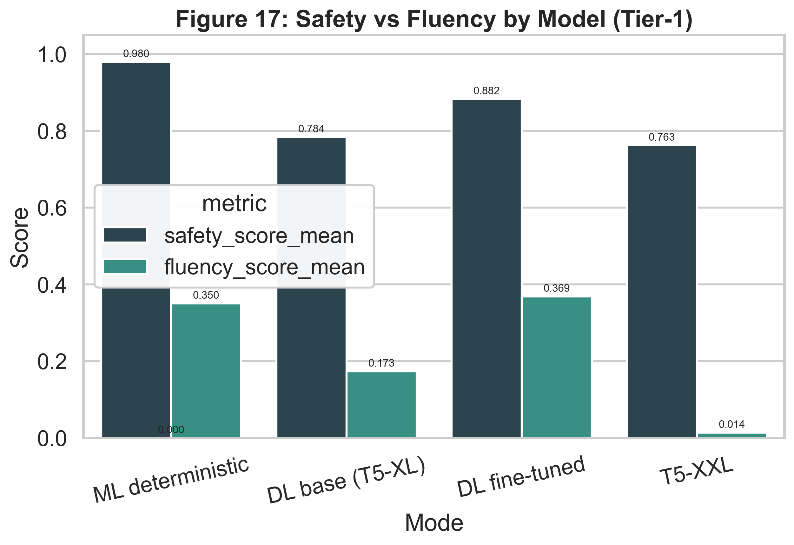
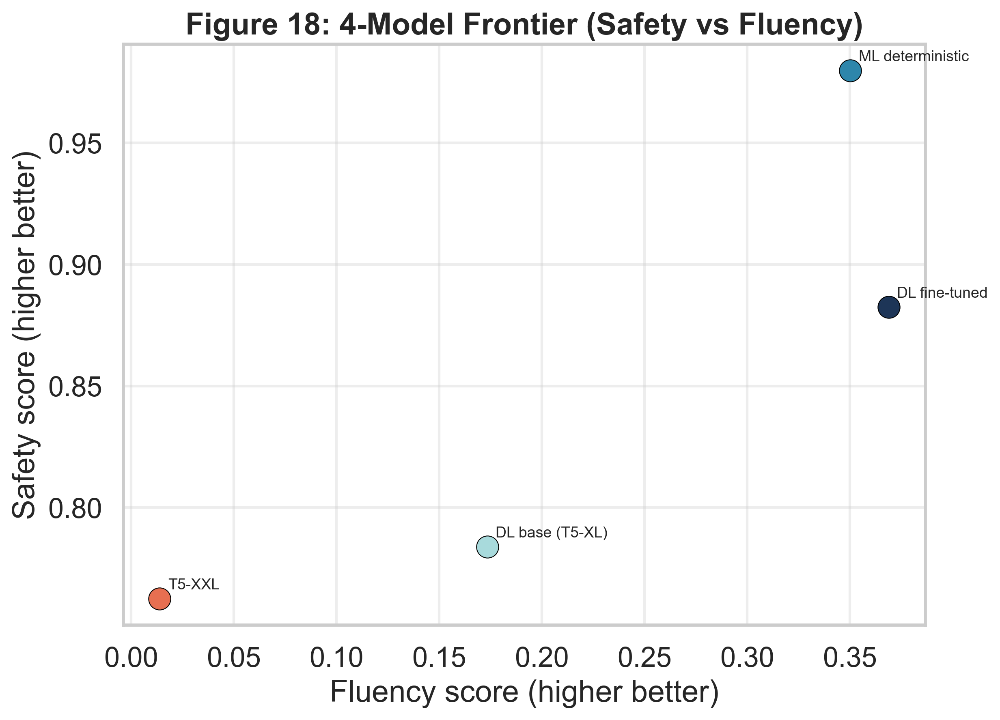
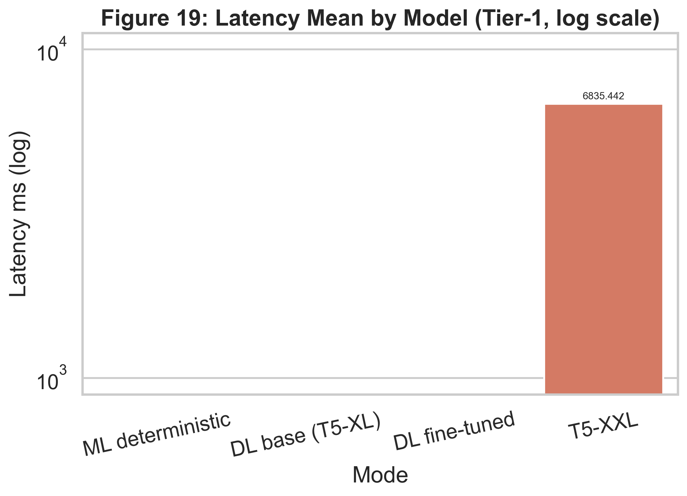

# Clinical Safety Summarization Progress Report

Date: 19 March 2026  
Project: Clinical Safety Table-to-Narrative Summarization

## 1) Problem Statement

The project addresses a high-stakes NLP task: converting structured clinical safety tables into regulatory-style narrative summaries. In this domain, fluency is important, but factual safety is mandatory. A fluent output that alters numeric values is not acceptable for regulatory use.

The main technical challenge is balancing two competing requirements:

- strict numeric faithfulness and low hallucination risk
- readable, publication-grade narrative quality

## 2) What We Built

We implemented a hybrid ML+DL system instead of relying on a single generative model.

- Deterministic ML pipeline for safe factual grounding
- DL rewriting layer for improved prose quality
- Verification gate and fallback behavior to protect factual integrity

System architecture reference:

## 3) Approaches We Tried

We evaluated four operating modes on the same Tier-1 benchmark set (41 examples):

1. ML deterministic (`ml`)
2. DL base (`dl_base`)
3. DL fine-tuned (`finetuned`)
4. T5-XXL comparison baseline (`t5xxl`)

This allowed controlled comparison of quality, safety, and latency tradeoffs.

## 4) Evaluation Setup

Evaluation used the consolidated 4-mode comparison artifact:

- `data/eval_results/final_4mode_comparison_tier1_20260319_114452.csv`

Primary tracked metrics for report decisions:

- ROUGE-L (content overlap quality)
- NAR/HR/OR/ACR (faithfulness and error profile)
- Safety score
- Fluency score
- Mean and P95 latency

## 5) Key Results (4-Model Comparison)

### 5.1 Compact Metrics Table (Tier-1, n=41)

| Mode | ROUGE-L | NAR | HR | OR | ACR | Safety | Fluency | Latency Mean (ms) | Latency P95 (ms) |
|---|---:|---:|---:|---:|---:|---:|---:|---:|---:|
| ML deterministic | 0.6878 | 1.0000 | 0.0000 | 0.0000 | 0.1022 | 0.9796 | 0.3503 | 0.00 | 0.00 |
| DL base | 0.4270 | 0.7779 | 0.3554 | 0.0000 | 0.2475 | 0.7839 | 0.1735 | 0.00 | 0.00 |
| DL fine-tuned | 0.7422 | 0.9862 | 0.0462 | 0.0000 | 0.5062 | 0.8824 | 0.3690 | 0.00 | 0.00 |
| T5-XXL | 0.0000 | 0.7287 | 0.2764 | 0.2683 | 0.0987 | 0.7625 | 0.0139 | 6835.44 | 7795.41 |

### 5.2 Result Figures

Faithfulness comparison across the four approaches:

Safety and fluency tradeoff:

Frontier visualization for model selection:

Latency tradeoff:

### 5.3 Interpretation

- `finetuned` achieved the best ROUGE-L (0.7422) with stronger fluency than deterministic ML.
- `ml` remained the safest profile in this run (highest safety score: 0.9796).
- `dl_base` underperformed on both quality and safety versus `finetuned`.
- `t5xxl` had substantial latency cost (~6.8s mean, ~7.8s p95) and weak practical quality in this benchmark setup.

## 6) Work Completed To Date

### 6.1 Data and Benchmarking

- Data extraction, processing, and benchmark preparation pipelines are operational.
- Tiered evaluation artifacts and run manifests are generated under `data/eval_results/`.

### 6.2 ML System Implementation

- Deterministic generation backbone implemented and integrated.
- Content selection and slot-fill generation path operational.

### 6.3 DL System Implementation

- Base and fine-tuned DL modes integrated.
- Fine-tuned path includes verification gate and fallback behavior.

### 6.4 Evaluation and Analysis

- Full metrics suite, ablation outputs, and comparative plotting scripts are implemented.
- 4-mode comparison workflow is reproducible and current.

### 6.5 Frontend and Demonstration

- Frontend application includes comparison workflows and user-facing summarization flow.

## 7) What We Learned

1. Hybrid design is stronger than pure generation for this regulated task.
2. Verification controls are necessary when using DL rewriting.
3. Fine-tuning improved quality over base DL while keeping safety at acceptable levels.
4. Larger models are not automatically better for this use case when latency and grounding are considered.

## 8) Next Milestones

1. Improve safety-quality balance in fine-tuned mode (targeted reduction in HR/ACR).
2. Extend evaluation to additional stress scenarios and edge-case safety tables.
3. Refine frontend reporting views for direct export of comparison evidence.
4. Prepare final paper-ready figure/table package from the latest stable run.

## 9) Reproducibility References

- 4-mode comparison source: `data/eval_results/final_4mode_comparison_tier1_20260319_114452.csv`
- 4-mode figure generation: `scripts/generate_4mode_graphs.py`
- Combined image assembly: `scripts/generate_combined_images.py`
- Evaluation runner: `run_full_evaluation.py`
